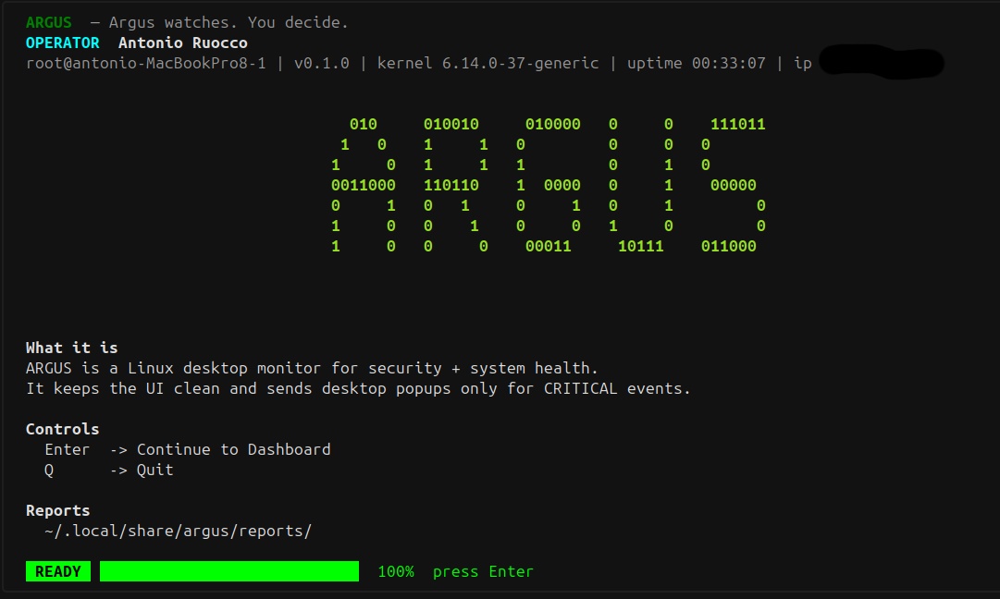
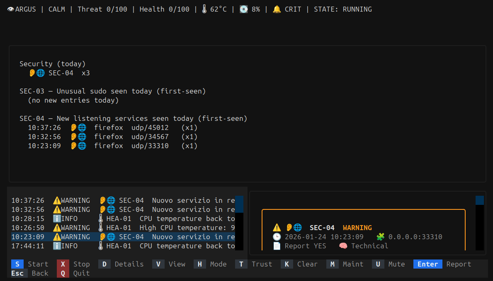

# ARGUS-Eye 👁️

**Linux-first home desktop security + health monitoring**  
Systemd **--user** service • Desktop notifications • Textual TUI • SQLite • Markdown reports

[](https://github.com/isilderrr1/argus-eye/actions/workflows/ci.yml)


> **ARGUS watches. You decide.**

<p align="center">
  
</p>

<p align="center">
  
</p>

---

## What it is

ARGUS-Eye is a **local** Linux monitor that surfaces security + system-health signals in a clean TUI.
It keeps the UI readable and sends desktop popups **only for CRITICAL events**.

---

## Highlights

- **Textual TUI** dashboard (event feed + details)
- **Security (SEC-xx)** + **Health (HEA-xx)** detectors
- **SQLite** event store (persistent history)
- **Reports** in Markdown (evidence + advice)
- **Desktop notifications** via DBus
- **systemd --user** service (start at login, view logs, enable/disable)
- **Doctor** command to validate environment & produce “issue-ready” output

---

## Install (recommended: pipx)

pipx installs CLI apps in isolated environments (perfect for tools like ARGUS).

### 1) Install pipx (Ubuntu/Debian)

```bash
sudo apt update
sudo apt install -y git pipx
pipx ensurepath
```

### 2) Install ARGUS-Eye (stable tag)

```bash
pipx install "git+https://github.com/isilderrr1/argus-eye.git@v0.1.1"
```

Upgrade later:

```bash
pipx upgrade argus-eye
```

> If you want the latest development version, replace `@v0.1.1` with `@master`.

---

## Quick start (2 minutes)

1) Run diagnostics:

```bash
argus doctor
argus -h
```

2) Launch the TUI (default command):

```bash
argus
```

3) Install/update the systemd user unit (pipx-friendly):

```bash
argus install-service
```

4) Enable at login + start now:

```bash
argus enable
```

5) View logs:

```bash
argus logs
```

Useful quick checks:

```bash
argus status
argus notify-test
```

---

## Troubleshooting (for testers)

If something fails, please open an Issue and paste:

```bash
argus doctor --issue
```

---

## Repository layout

- `src/argus/` — core app + TUI + detectors/collectors
- `systemd/` — unit templates / helpers
- `docs/` — screenshots and documentation

---

## License

MIT
